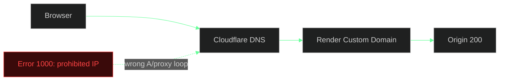

# Dark presentation diagram

```mermaid
%%{init: {'theme':'dark','themeVariables':{'background':'#0a0a0a','primaryColor':'#0a0a0a','primaryTextColor':'#66ff99','lineColor':'#66ff99'}}}%%
flowchart LR
 B[Browser] --> C[Cloudflare DNS]
 C --> R[Render Custom Domain]
 R --> O[Origin 200]
 X[Error 1000: prohibited IP]:::bad -. wrong A/proxy loop .-> C
 classDef bad fill:#3a0a0a,color:#ff4444,stroke:#ff4444;
```
